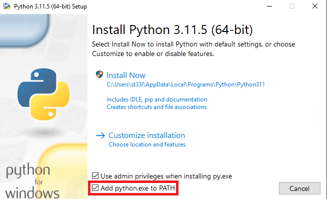

# Chicken Map

A 2D coordinate mapping program for monitoring the location of chickens.

Version 2023.10.3

## Table of Contents

- [Key Knowledge](#key-knowledge)
  
  - [Windows](#windows)
  
  - [MacOS](#macos)

- [Prerequisites](#prerequisites)
  
  - [Windows](#windows-1)
  
  - [MacOS](#macos-1)

- [Installation](#installation)
  
  - [Windows](#windows-2)
  
  - [MacOS](#macos-2)

- [How to Use](#how-to-use)
  
  - [Instructions](#instructions)

- [Usage](#usage)
  
  - [Windows](#windows-3)
  
  - [MacOS](#macos-3)
  
  - [Examples](#examples)

- [Compatibility](#compatibility)

- [Privacy](#privacy)

- [Support](#support)

- [Development](#development)
  
  - [Style and Formatting](#style-and-formatting)
  
  - [Decisions](#decisions-nerd-questions)
  
  - [Tools Used](#tools-used)

- [License](#license)

## Key knowledge

### Windows

- To open a command prompt, press the Windows key or click the Start Menu, type *cmd*, and press enter.

- To execute a command, type the command and press Enter.

- To paste into a command prompt, right-click.

- To re-run a previous command, navigate between them using the up and down arrow keys, then press Enter.

- If you have any issues with commands not being recognized after installing Python, Tesseract, or packages using `pip3`, close all command prompt windows and open a new one.

### MacOS

- To open a Terminal, press Cmd + space, type *terminal*, and press Return/Enter.

- To execute a command, type the command and press Return/Enter.

- To paste into a Terminal, right-click.

- To re-run a previous command, navigate between them using the up and down arrow keys, then press Enter.

- If you have any issues with commands not being recognized after installing Python, Tesseract, or packages using `pip3`, close all Terminals and open a new one.

## Prerequisites

### Windows

- Tesseract 5.x. (tested with 5.3.1). Download the latest [here for Windows](https://digi.bib.uni-mannheim.de/tesseract/tesseract-ocr-w64-setup-5.3.1.20230401.exe) and install.

- Python 3.8+ (tested with 3.8, 3.11, 3.12). Download the latest for your system [here](https://www.python.org/downloads/).
  
  - On Windows, when installing, make sure to check the *Add python.exe to PATH* box, then click *Install Now*. At the end, you'll have the option to *Disable path length limit*. While not necessary for this program, it's a good idea to click that option.
    
    
  
  - After installation, if another command prompt window pops up and the characters to the left are `>>>`, close out of that command prompt. Then, verify that Python3 and pip3 are installed in a normal command prompt, which starts with `C:\`. If both respond with a version number, you're good to go:
    
    ```bash
    py --version
    pip3 --version
    ```

### MacOS

- Tesseract 5.x (tested with 5.3.2).
  
  - First, install homebrew if not already installed (you probably don't have it):
    
    ```bash
    /bin/bash -c "$(curl -fsSL https://raw.githubusercontent.com/Homebrew/install/HEAD/install.sh)"
    ```
  
  - Then install Tesseract:
    
    ```bash
    brew install tesseract
    ```

- Python 3.8+ (tested with 3.8, 3.11, 3.12). Download the latest for your system [here](https://www.python.org/downloads/).
  
  - After installation, verify that Python3 and pip3 are installed in a Terminal. If both respond with a version number, you're good to go:
    
    ```bash
    python3 --version
    pip3 --version
    ```

## Installation

[Download a zip](https://github.com/lorians22/ChickenMap/archive/refs/heads/main.zip) of this code, then extract. Required Python libraries for this program:

- OpenCV-Python

- Python-tesseract

- Pillow

- openpyxl

These can be installed automatically by opening a command prompt/Terminal, navigating to the folder, and using `pip3` to read the requirements file:

### Windows

```bash
  cd %USERPROFILE%\Downloads\ChickenMap-main\ChickenMap-main
  pip3 install -r requirements.txt
```

### MacOS

```bash
  cd ~/Downloads/ChickenMap-main
  pip3 install -r requirements.txt
```

## How To Use

Overly-detailed command line usage can be found under [Usage](#usage). They might confuse you in their current state, so feel free to ignore. To test things out, if you don't already have a command prompt/Terminal open and navigated to the ChickenMap folder, do so:

    Windows: `cd %USERPROFILE%\Downloads\ChickenMap-main\ChickenMap-main`

    MacOS:     `cd ~/Downloads/ChickenMap-main`

Then, run the program with the provided test video:

    Windows: `py chickenMap.py test.mp4`

    MacOS:     `python3 chickenMap.py test.mp4`

### Instructions

- Press `q` to quit the program. Clicking the X in the corner (on Windows) will just replace the video with another window.

- Press `p` to pause the video. Press `p` again to resume. The video is automatically paused while annotating but will resume once `Enter` is pressed, unless you pressed `p` beforehand.

- Left-click anywhere to produce a coordinate at your cursor.
  
  - Coordinates are saved along with their video timestamps (from the top-left corner of the video) in an Excel file in the `sheets/` directory. You can find this .xlsx file in the `ChickenMap-main/` folder. Filenames are based on your system's date and time when the program started.
  
  - Coordinates remain on screen for 5 seconds after click by default. Press `c` while a coordinate is on-screen to clear it from the screen and remove it from the Excel sheet. Once the coordinate is off-screen, the coordinate cannot be cleared from the Excel sheet.
  
  - Coordinates and timestamps are printed to the Command Prompt/Terminal window as a backup and are not removed when `c` is pressed.

- Right-click to annotate at your cursor.
  
  - The video will freeze/pause. Each key you press will show up on screen, at the location you right-clicked.
    
    - Press `Enter` to save the annotated image and resume the video.
    
    - Press `Esc` to cancel annotating. If the video was not manually paused before, the video will resume.
    
    - Press `Backspace` just as you would normally to remove letters from the annotation.
    
    - Annotations will stay on screen for 5 seconds by default.
  
  - Annotated images are saved as `.jpg`s in the `annotated_images/<timestamp>` directory, where `<timestamp>` is the system date/time when you ran the program. Filenames are based on the timestamp in the top-left corner of the video; annotations at the same timestamp are given a `_#` suffix to prevent overwriting.

## Usage

See [Examples](#examples) for platform-specific instructions (what you should actually type into the command line). `VIDEO_PATH` is a required argument; arguments encapsulated by brackets are optional.

```bash
py chickenMap.py VIDEO_PATH [out_dir] [anno_dir] [exit_key] \
    [clear_key] [duration]
```

You can view command-line options by typing:

```bash
py chickenMap.py -h
```

| Short Argument | Long Argument | Description                                                    | Default           |
| -------------- | ------------- | -------------------------------------------------------------- | ----------------- |
| -od            | --out_dir     | Name of output folder for Excel files                          | sheets/           |
| -ad            | --anno_dir    | Name of output folder for annotated images                     | annotated_images/ |
| -e             | --exit_key    | Key to quit program (a-z, 0-9)                                 | q                 |
| -c             | --clear_key   | Key to remove coordinate from screen and Excel file (a-z, 0-9) | c                 |
| -d             | --duration    | Duration of coordinates on screen, in seconds                  | 5                 |

Full options are available in the `options.txt` file. You can open this file with Notepad (Windows) or TextEdit (MacOS), or your favorite text editor, if you have one. Make sure to save the file after you change options. Any option not entered at the command line will default to the one stored in this file. Here, you can also edit font, font color, font scale, and font thickness. See the comments in the file for limitations.

You can change all the settings you want in `options.txt` and just type `py chickenMap.py VIDEO_PATH` into the command line, and the program will use the settings you entered into `options.txt`. Options entered at command line are saved to `options.txt` so you don't have to retype them each time.

### Windows

In a new command prompt:

```bash
cd %USERPROFILE%\Downloads\ChickenMap-main\ChickenMap-main
py chickenMap.py VIDEO_PATH
```

`VIDEO_PATH` should not be typed out; it should be the filename of the video you want to play. You can drag a video file from File Explorer into the command prompt window and press enter to run the program; this makes it easy if your video is stored on an external hard drive. Just make sure to add a space after `py chickenMap.py` before dragging a video file into the window.

### MacOS

In a new Terminal:

```bash
cd ~/Downloads/ChickenMap-main
python chickenMap.py VIDEO_PATH
```

`VIDEO_PATH` should not be typed out; it should be the filename of the video you want to play. You can drag a video file from Finder into the Terminal window and press enter to run the program; this makes it easy if your video is stored on an external hard drive. Just make sure to add a space after `python chickenMap.py` before dragging a video file into the window.

### Examples

Basic, uses the options in `options.txt`:

```bash
py chickenMap.py test.mp4
```

Set the exit key to `Esc` and the duration of on-screen coordinates and annotations to 2 seconds, with the other options being filled in from `options.txt`:

```bash
py chickenMap.py test.mp4 -e Esc -d 2
```

## Compatibility

Tested with:

- Devices and Platforms
  
  - Windows
    
    - AM4 PC running Windows 10 Pro 22H2 (build 19045)
    
    - Samsung laptop running Windows 11 Home 22H2 (build 22621)
    
    - 2015 MacBook Pro (Intel) running Windows 10 Home via Boot Camp
  
  - MacOS
    
    - 2020 MacBook Air (M1) running MacOS 13
    
    - 2015 MacBook Pro (Intel) running MacOS 12.6.3
    
    - AM4 PC running MacOS 12.6 via OpenCore
  
  - *Linux probably works since MacOS works, but I offer no detailed instructions for it (you run Linux — you can figure it out).*

- Software
  
  - Tesseract-OCR 5.12, 5.11
  
  - Python 3.12, 3.11, 3.9
    
    - OpenCV-Python 4.8.0.74
    
    - Python-tesseract 0.3.10
    
    - Pillow 10.0.0
    
    - openpyxl 3.1.2

## Privacy

This program does not store or transmit any user data to an external source and can run without connection to the Internet. Your OS/platform (Windows, MacOS) is determined at runtime to point `pytesseract` to the Tesseract-OCR executable on Windows, and it is not stored after the program exits. Program errors and platform info (OS version, Python version, processor name) are stored in `error_log.txt` and are not transmitted by this program; if you have errors, see [Support](#support).

## Support

For non-guaranteed support, email me at logan.orians@gmail.com or message me on [Discord](https://discord.com/users/l_orians). Please attach `error_log.txt` to your message and describe what you were doing when the error occurred.

## Development

### Style and Formatting

This code attempts to follow both [PEP 8](https://peps.python.org/pep-0008/) and the [Google Python Style Guide](https://google.github.io/styleguide/pyguide.html), with programmer's freedom on conflicting elements, and line width set to 100 characters (not 80) because it's 2023 and we have high-resolution and ultrawide monitors.

## Decisions (Nerd Questions)

**Q:** Why did you define the mouse callback function as a nested function in `main()`? In previous versions, it was a method of the `MouseCallbackHandler` class. And why did you need it as an instance method before?

**A:** My understanding was that nested functions have *read-only* access to variables in the enclosing scope. While this is true for variables, I determined (through testing) that it does not apply to attributes of a class instance or `SimpleNamespace`. So, I was able to define `mouse_input()` in main, reducing the need for a class. I had the callback function in a class before because it has no return statement and I needed to get `x` and `y` from it.

**Q**: Why did you make a coord a `SimpleNamespace`?

**A**: At one point, it was a class or part of a class. Making it a `SimpleNamespace` allowed me to reuse the `.attribute` notation in my code, saving me time.

**Q:** Why didn't you use a proper UI library or toolkit?

**A:** I didn't have experience with UIs in Python, but I had experience with OpenCV. OpenCV was able to do what I needed.

### Tools Used

- [Sublime Text 4](https://www.sublimetext.com/), [Notepad++](https://notepad-plus-plus.org/) and [VSCode](https://code.visualstudio.com/) for text editing and programming

- [MarkText](https://www.marktext.cc/) for README editing

## License

Approved for private use by students and employees of Purdue University only. No implied support or warranty. Copyright 2023, Logan Orians in affiliation with Purdue University: Dr. Marisa Erasmus and Gideon Ajibola.
