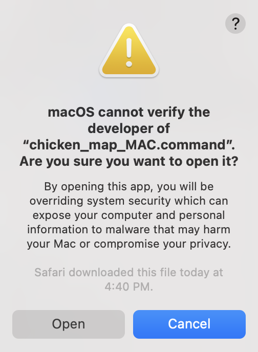
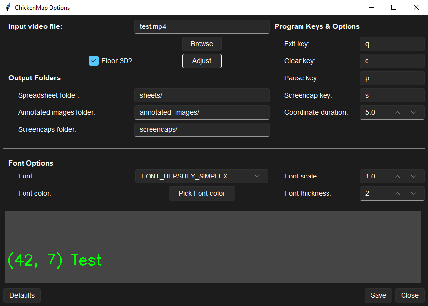

# Chicken Map

A coordinate mapping program for monitoring the location of chickens.

Version 2023.12.1

<details>
    <summary style="font-size:30px">**Table of Contents**</summary>
    - [Command Line Knowledge](#command-line-knowledge)
        - [Windows](#windows)
        - [macOS](#macos)
    - [macOS Gatekeeper Override](#macos-gatekeeper-override)
    - [Short Installation Instructions](#short-installation-instructions)
    - [Prerequisites](#prerequisites)
        - [Windows](#windows-1)
        - [macOS](#macos-1)
    - [Required Packages](#required-packages)
    - [How to Use](#how-to-use)
        - [chicken_map Instructions](#chicken_map-instructions)
    - [Usage](#usage)
        - [options_gui](#options_gui)
    - [Compatibility](#compatibility)
    - [Privacy](#privacy)
    - [Development](#development)
        - [Third-Party Resources](#third-party-resources)
        - [Tools Used](#tools-used)
        - [Style and Formatting](#style-and-formatting)
        - [Type Hints](#type-hints)
        - [Nerd Questions](#nerd-questions)
    - [Support](#support)
    - [License](#license)
</details>

## Command Line Knowledge

### Windows

- To open a command prompt, press the Windows key or click the Start Menu, type *cmd*, and press enter.

- To execute a command, type the command and press Enter.

- To paste into a command prompt, right-click.

- To re-run a previous command, navigate between them using the up and down arrow keys, then press Enter.

- If you have any issues with commands not being recognized after installing Python, Tesseract, or packages using `pip3`, close all command prompt windows and open a new one.

### macOS

- To open a Terminal, press Cmd + space, type *terminal*, and press Return/Enter.

- To execute a command, type the command and press Return/Enter.

- To paste into a Terminal, right-click.

- To re-run a previous command, navigate between them using the up and down arrow keys, then press Enter.

- If you have any issues with commands not being recognized after installing Python, Tesseract, or packages using `pip3`, close all Terminals and open a new one.

## macOS Gatekeeper Override

For macOS users, running `.command` files downloaded from the Internet will likely trigger the [Gatekeeper](https://support.apple.com/guide/security/gatekeeper-and-runtime-protection-sec5599b66df/web) and won't let you run the command.


This happens because I am unable to digitally sign the software without a certificate from a Certificate Authority, and this can be an annoyingly lengthy and <u>not free</u> process. Anyway, [Apple provides an override tutorial](https://support.apple.com/en-us/HT202491#openanyway). Basically:

- Open System Preferences (Settings).

- Nagivate to Privacy & Security/Security & Privacy, then click Open Anyway.
  
  | MacOS 12                                                                      | MacOS 13 |
  |:-----------------------------------------------------------------------------:| -------- |
  |  |          |

- Click Open.
  
  

## Short Installation Instructions

Please continue with the sections below for full instructions.

- Install Python 3.7+ and Tesseract 5.x

- Download zip of code

- Double-click `REQS_WIN.cmd` or `REQS_MAC.command`

## Prerequisites

### Windows

- Tesseract 5.x. (tested with 5.3.1). Download the latest [here for Windows](https://digi.bib.uni-mannheim.de/tesseract/tesseract-ocr-w64-setup-5.3.1.20230401.exe) and install.

- Python 3.7+ (latest recommended). Download the latest for your system [here](https://www.python.org/downloads/) and install. If you have Python installed already and want to see if your currently installed version is sufficient (i.e., >=3.7), type `py --version` in a [command prompt](#command-line-knowledge).
  
  
  
  - When installing, make sure to check the *Add python.exe to PATH* box, then click *Install Now*. At the end, you'll have the option to *Disable path length limit*. Click this option as well.

### macOS

- Tesseract 5.x (tested with 5.3.2).
  
  - First, install [Homebrew](https://brew.sh/) by downloading and running the `.pkg` [here](https://github.com/Homebrew/brew/releases/download/4.2.3/Homebrew-4.2.3.pkg). If you already have Homebrew installed and configured, you can skip to the last step: install Tesseract.
  
  - **Important!** After installation, open a [Terminal](#macos) and enter (copy+paste) the two commands that brew lists under Next Steps. Image shown below for reference only; note that the first command may extend onto the second line, so be sure to copy it entirely. Then, fully close Terminal by pressing `Cmd` + `q`, or by right-clicking the Dock icon and selecting `Quit`. Just pressing the red traffic light button may not be enough to refresh Terminal.
    
    
  
  - Open a new [Terminal](#macos) and install Tesseract:
    
    ```bash
    brew install tesseract
    ```

- Python 3.7+ (latest recommended). Download the latest for your system [here](https://www.python.org/downloads/) and install.

## Required Packages

[Download a zip](https://github.com/lorians22/ChickenMap/archive/refs/heads/main.zip) of this code, then extract. Required Python libraries for this program:

- NumPy

- OpenCV-Python

- openpyxl

- Pillow

- Python-tesseract

- sv-ttk (optional but recommended — it makes the options GUI look better)

These can be installed by double-clicking the `REQS_WIN.cmd` file on Windows or `REQS_MAC.command` on macOS. macOS users will likely be prompted with a security pop-up; follow [these instructions](#macos-gatekeeper-override).

Once the script finishes installing the packages, if you see "INSTALLATION COMPLETE. YOU MAY NOW CLOSE THIS WINDOW" toward the bottom, you are all set to run the program. If you don't see this message or you see an error message (in red on macOS), please [contact the author](#support).

## How To Use

Command line usage can be found under [Usage](#usage), but you shouldn't need to use a command prompt or Terminal anymore! To test things out, run the test video by double-clicking the `chicken_map.py` file. If this opens in a text editor instead of running the program, double-click `chicken_map_WIN.cmd` on Windows or `chicken_map_MAC.command` on macOS. macOS users will likely encounter a security warning; bypass this by following [these instructions](#macos-gatekeeper-override).

After testing out the program with the [instructions](#chicken-map-instructions) below, double-click the `options_gui.py` file to edit program options, including choosing the video file to be played. A detailed list of program options can be found [here](#options_gui). As before, if this opens in a text editor, double-click the `options_gui_WIN.cmd` file on Windows or `options_gui_MAC.command` file on macOS.

### chicken_map Instructions

- Press `q` to quit the program. Clicking the X in the corner (on Windows) will just replace the video with another window.

- Press `p` to pause the video. Press `p` again to resume. The video is automatically paused while annotating but will resume once `Enter` is pressed, unless you pressed `p` beforehand.

- Left-click anywhere to produce a pixel coordinate at your cursor.
  
  - Pixel coordinates are saved along with their video timestamps (from the top-left corner of the video) in an Excel file in the `sheets/` directory. You can find this .xlsx file in the `ChickenMap-main/` folder. Filenames are based on your system's date and time when the program started. 
    
    - 3D coordinates in meters, where the origin (0, 0, 0) is the back left inside the nesting boxes, are added as an additional column if the `3D?` box is checked in `options_gui`. The x-coordinate is the width of the room (from the left of the screen to the right). The y-coordinate is the length of the room (from the back to the front, so from the top of the screen to the bottom). The z-coordinate is the height off the floor and is a hard-coded estimate based on the region of the room. If the 3D coordinates are empty `( )`, the coordinate you chose is out of the defined bounding boxes. These may need adjusted based on user feedback and camera position.
  
  - Coordinates remain on screen for 5 seconds after click by default. Press `c` while a coordinate is on-screen to clear it from the screen and remove it from the Excel sheet. Once the coordinate is off-screen, the coordinate cannot be cleared from the Excel sheet.
  
  - Coordinates and timestamps are printed to the Command Prompt/Terminal window as a backup and are not removed when `c` is pressed.

- Right-click to annotate the current video frame at your cursor.
  
  - The video will freeze/pause. Each key you press will show up on screen, at the location you right-clicked.
    
    - Press `Enter` to save the annotated image and resume the video.
    
    - Press `Esc` to cancel annotating. If the video was not manually paused before, the video will resume.
    
    - Press `Backspace` just as you would normally to remove letters from the annotation.
    
    - Annotations will stay on screen for 5 seconds by default.

- Press `s` to save a screencap of the current frame. A "Screencap saved!" message will appear in a set position on the screen. Screencaps are saved to the `screencaps/` folder, inside a folder named for the date and time that you ran the program.
  
  - Annotated images are saved as `.jpg` files in the `annotated_images/<timestamp>` directory, where `<timestamp>` is the system date/time when you ran the program. Filenames are based on the timestamp in the top-left corner of the video; annotations at the same timestamp are given a `_#` suffix to prevent overwriting.

## Usage

```bash
chicken_map.py [-h] [-o]
```

You can set program options via a GUI with:

```bash
chicken_map.py -o
```

Please do not edit the `.options.json` file directly (if you see it).

### options_gui

If you can't see the entire GUI, enter full screen (Maximize on Windows or the green traffic light button on MacOS).

Change the options as you see fit. There is a font preview at the bottom to show how your selected font options will look in `chicken_map`. Press Save to save your options. Press Close to close the program. Press Defaults to reset the options to default; **you must press Save** after pressing Defaults for the default options to apply to `chicken_map`.

**Input video file**: Use the file dialog window to choose the chicken video

**3D?**: If you want to get 3D coordinates for the Floor area, check the box

**Spreadsheet folder**: the folder containing the Excel sheets of timestamped coordinates

**Annotated images folder**: the folder containing *annotated* video frame grabs

**Screencaps folder**: the folder containing *unannotated* video frame grabs

**Exit key**: the key to exit `chicken_map.py`

**Clear key**: the key to clear the on-screen coordinate from the Excel sheet

**Pause key**: the key to pause and unpause the video

**Screencap key**: the key to capture the current video frame

**Coordinate duration**: the time, in seconds, that coordinates will stay on screen after clicking and annotations will stay on screen after pressing Enter

**Font**: the font for coordinates and annotations

**Font color**: 16.7 million colors for the font

**Font scale**: how big the font is

**Font thickness**: how thick the font is

## Compatibility

Tested with:

- Devices and Platforms
  
  - Windows
    
    - AM4 PC running Windows 10 Pro 22H2 (build 19045)
    
    - Samsung laptop running Windows 11 Home 22H2 (build 22621)
    
    - 2015 MacBook Pro (Intel) running Windows 10 Home via Boot Camp
  
  - macOS
    
    - 2020 MacBook Air (M1) running macOS 12.6.3
    
    - 2015 MacBook Pro (Intel) running macOS 12.6.3
    
    - AM4 PC running macOS 13 via OpenCore
  
  - *Linux probably works since macOS works, but I offer no detailed instructions for it (you run Linux — you can figure it out).*

- Software
  
  - Tesseract-OCR 5.12, 5.11
  
  - Python 3.12, 3.11, 3.9
    
    - OpenCV-Python 4.8.0.74
    
    - openpyxl 3.1.2
    
    - Pillow 10.0.0
    
    - Python-tesseract 0.3.10

## Privacy

This program does not transmit any user data to an external source. Your OS/platform (Windows, macOS) is determined at runtime to point `pytesseract` to the Tesseract-OCR executable on Windows for `chicken_map` and to determine the system theme (light or dark) for `options_gui`. If the program encounters an error, the following non-identifying information is stored locally in `error_log.txt`:

- Python version (e.g., 3.12)

- OS version and build number (e.g., Windows 10.0.19045)

- CPU architecture (AMD, Intel, etc.)

This information is helpful for debugging purposes but is <u>not</u> transmitted for telemetry or error reporting automatically. See [Support](#support).

## Development

### Third-Party Resources

- [NumPy](https://pypi.org/project/numpy/)

- [OpenCV-Python](https://pypi.org/project/opencv-python/)

- [openpyxl](https://pypi.org/project/openpyxl/)

- [Pillow](https://pypi.org/project/Pillow/)

- [Python-tesseract](https://pypi.org/project/pytesseract/)

- [Sun Valley theme by rdbende](https://pypi.org/project/sv-ttk/)

### Tools Used

- [Sublime Text 4](https://www.sublimetext.com/), [Notepad++](https://notepad-plus-plus.org/) and [VSCode](https://code.visualstudio.com/) for text editing and programming

- [MarkText](https://www.marktext.cc/) and [Overleaf](https://www.overleaf.com/) for README editing

### Style and Formatting

This code attempts to follow [PEP 8](https://peps.python.org/pep-0008/) and the [Google Python Style Guide](https://google.github.io/styleguide/pyguide.html) for style and formatting, with programmer's freedom on any conflicting or unaddressed elements.

### Type Hints

This code follows [PEP 484](https://peps.python.org/pep-0484/) + [PEP 604](https://peps.python.org/pep-0604/) for type hints (function calls only) to lend some static typing to the program. [mypy](https://pypi.org/project/mypy/) was used for type checking. Please note that most of the type hint formatting follows conventions supported in Python 3.9+, and 3.10+ for union types.

### Nerd Questions

**Q:** Why didn't you use camera and stereo calibration for 3D coordinates?

**A:** I tried. Individual camera calibration went swimmingly, but the disparity map for stereo calibration was awful, no matter what parameters I adjusted. I ended up just masking polygonal regions of interest (ROIs) with numpy and OpenCV, then using a very basic (and manual, so not the highest accuracy) [homography](https://en.wikipedia.org/wiki/Homography_(computer_vision)) to calculate position.

**Q:** Why does the video feel slow?

**A:** It feels slow because it is. In my experience, the video is about 20% slower than real time, and this isn't dependent on the speed of the computer or how much code runs or anything else performance-based. `cv2.waitKey(delay)`, with the delay based on the framerate of the video, has worked perfectly for me in the past, but now it's just not right. I may have a fix soon, but I have to restructure a lot of code and make sure that doesn't break anything.

**Q:** Why did you change the mouse callback function for OpenCV so much?

**A:** All the tutorials suck and just have you use a global variable if you need to get something like `x` and `y` from the callback (you can't grab the return value of a callback function). Nothing explicitly wrong with globals, I just like to avoid them when I can so I don't risk interfering with something unexpected. You can set the callback function to a class method, define it in main() as a nested function, or actually read the documentation and notice that the `param` argument might as well be nearly purpose-built for this, and yet no one uses it. Just pass in an *object* for `param` and set a value in the callback and bam, problem solved. Nested function in main() is pretty good though.

**Q:** Why did you make *x* a `SimpleNamespace` instead of a `dict`?

**A:** I really like the dot notation for accessing object attributes and often find myself trying to use it on dicts. If I don't need to do anything fancy with key-value pairs, why not make it easier on myself? Plus it looks cleaner, in my opinion.

**Q:** Why didn't you use a modern UI library or toolkit?

**A:** I didn't have experience with modern UIs in Python, but I had experience with tkinter/Tcl/Tk and OpenCV. OpenCV and tkinter (with a good theme) were able to do what I needed. Feel free to rewrite using [PyQt5](https://pypi.org/project/PyQt5/), [DearPyGUI](https://pypi.org/project/dearpygui/), [PySimpleGUI](https://pypi.org/project/PySimpleGUI/), or other modern cross-platform framework and fork/pull request. Not sure what else exists for OpenCV, but go nuts.

**Q:** Why did you use a [third-party theme](https://github.com/rdbende/Sun-Valley-ttk-theme) for the GUI instead of just the built-in ones?

**A:** Honestly, I didn't want to spend the time to make a dark version of the default theme for Windows (and yes, a dark mode was totally necessary). macOS's default `aqua` theme handled it automatically without me telling it to, but Windows would have just taken too long to get right (unless I'm missing something obvious). It's only a few lines of code to determine the system theme, so adding a theme where I can just tell it "light" or "dark" was far less of a headache. And the theme looks better, in my opinion.

**Q:** Why did you make certain files and folders hidden?

**A:** If it's harder for the user to find, it's harder for the user to mess with.

**Q:** Why did you just encapsulate most of `main()` in a try-except block?

**A:** Laziness and simplicity.

## Support

For support, email me at [logan.orians@gmail.com](mailto:logan.orians@gmail.com) with "chicken map" in the subject line, or message me on [Discord](https://discord.com/users/l_orians) and I will get back to you as soon as possible. Please attach `error_log.txt` to your message (and copy+paste or screenshot+attach any errors present in Command Prompt/Terminal) and describe what you were doing when the error occurred.

## License

GNU General Public License v3.0 ([GPLv3](COPYING)).
